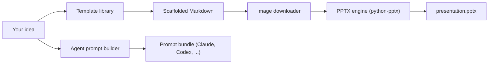

<div align="center">

# 🎴 Mocky

### From a one-line idea to a polished PowerPoint deck — on any OS.

_Pick a template, describe your idea, and let Mocky generate the Markdown, the AI-agent prompts, and the `.pptx` for you._

[](./LICENSE)
[](https://www.python.org/)
[](https://github.com/raman0c17/mocky/actions/workflows/ci.yml)
[](./CONTRIBUTING.md)
[](#-platform-support)
[](./CODE_OF_CONDUCT.md)

[Quick Start](#-quick-start) · [How it works](#-how-it-works) · [Templates](#-template-library) · [AI agent prompts](#-ai-agent-prompts) · [Library](#-use-as-a-library) · [Docker](#-run-with-docker) · [Claude Skill](#-use-as-a-claude-skill) · [Roadmap](#-roadmap)

</div>

---

## ✨ What is Mocky?

Mocky is an open-source CLI and Python library that turns ideas into **PowerPoint presentations (`.pptx`)**. It works two ways:

1. **Idea → deck.** Describe your idea, pick one of the built-in **templates**, and Mocky scaffolds structured Markdown, generates **ready-to-paste prompts for 15+ AI coding agents** (Claude, Codex, Cursor, Gemini, and more), and renders a `.pptx`.
2. **Markdown → deck.** Already have Markdown? Drop it in `input_files/` and Mocky converts it directly.

- 🧠 **Idea-first workflow** — go from a sentence to a draft deck in seconds.
- 🧩 **Template library** — `basic`, `problem-solution`, and `product-launch` scaffolds.
- 🤖 **Agent prompt bundles** — generate prompts for Claude, Codex, Cursor, Gemini, Grok, and more.
- 🖼️ **Automatic images** — referenced images are downloaded and embedded.
- 🖥️ **Runs anywhere** — Windows (x64/ARM), macOS (Intel/Silicon), Linux. No Office install required.
- 🐳 **Container- and library-ready** — ship it as a Docker image or `import mocky`.
- 📦 **Agent-ready repo** — ships with [`AGENTS.md`](./AGENTS.md) and a [Claude Skill](./skills/mocky/SKILL.md).

---

## 🚀 Quick Start

```bash
# 1. Install
pip install mocky        # or: pip install -e ".[dev]" from source

# 2. (Optional) set up agent keys
cp .env.example .env     # then fill in the keys you actually use

# 3. Run
mocky
```

You'll get an interactive menu:

```
Choose an action:
1: Generate a presentation from an idea
2: Convert an existing Markdown file to PPT
0: Exit
```

Generated artifacts land in:

- `presentations/` — the `.pptx` decks
- `generated_markdowns/` — the scaffolded Markdown
- `prompt_outputs/` — the per-agent prompt bundles

---

## 🧩 How it works



1. **Choose a template** and enter your idea.
2. **Scaffold Markdown** from the template (`#` = deck title, each `##` = a slide).
3. **Generate agent prompts** so you can refine the draft with your favorite AI agent.
4. **Download images** referenced in the Markdown.
5. **Render** a cross-platform `.pptx` with the pure-Python engine.

---

## 📚 Template library

| Template | Best for | Sections |
| --- | --- | --- |
| `basic` | General talks | Overview · Why It Matters · Key Points · Next Steps · Summary |
| `problem-solution` | Pitches & proposals | Problem · Solution · Benefits · Roadmap · Next Steps |
| `product-launch` | Launches | Market · Features · Go-To-Market · Metrics · Launch Plan |

Templates live in [`template_lib.py`](./src/mocky/template_lib.py) and are easy to extend — PRs adding new templates are very welcome.

---

## 🤖 AI agent prompts

Mocky generates tailored Markdown-deck prompts for these agents and reads their credentials from `.env`:

`Claude Code` · `Claude API` · `Anthropic API` · `Codex CLI` · `Cursor Agent` · `GitHub Copilot CLI` · `Gemini CLI` · `Gemini API` · `Grok` · `Qwen` · `Aider` · `Windsurf CLI` · `Trae CLI` · `Open Design` · `Hermes`

> 🔐 **Security:** copy `.env.example` to `.env` and never commit `.env`. It is already covered by `.gitignore`. Mocky does not transmit your keys anywhere — it only reads them locally to label prompt bundles.

---

## 🖥️ Platform support

Mocky's default rendering engine is built on [`python-pptx`](https://python-pptx.readthedocs.io/), a pure-Python library. It produces real `.pptx` files **without Microsoft PowerPoint**, and runs the same everywhere:

| Platform | Architecture | Supported |
| --- | --- | --- |
| Windows | x64 / ARM64 | ✅ |
| macOS | Intel / Apple Silicon | ✅ |
| Linux | x64 / ARM64 | ✅ |

> **Note:** earlier versions rendered with Windows-only COM automation (`pywin32`). The `python-pptx` engine replaces it as the default; see [`ROADMAP.md`](./ROADMAP.md) for migration notes.

---

## 📥 Installation

```bash
# From PyPI
pip install mocky

# From source
git clone https://github.com/raman0c17/mocky.git
cd mocky
pip install -e ".[dev]"
```

Requires Python **3.9+**. No Microsoft Office install needed. ✅

---

## 📝 Markdown input format

```md
# My Presentation

## Slide 1
This is the first slide.


## Slide 2
- Bullet A
- Bullet B
```

- `# ` (first H1) → presentation title
- `## ` → a new slide
- Paragraphs, lists, images and links become slide content

---

## 📦 Use as a library

```python
from mocky import MarkdownParser, PowerPointGenerator, TemplateLibrary, AgentPromptBuilder

# Idea -> Markdown
markdown = TemplateLibrary.build_markdown("Launching Mocky 1.0", "product-launch")

# Idea -> agent prompts
prompts = AgentPromptBuilder.build_all_prompts("Launching Mocky 1.0", "product-launch")

# Markdown -> PPTX (cross-platform)
parsed = MarkdownParser().parse_markdown("input_files/my_slides.md")
PowerPointGenerator().create_presentation(parsed["slides"], "presentations/my_slides.pptx")
```

---

## 🐳 Run with Docker

```bash
docker build -t mocky .

docker run --rm -it \
  -v "$(pwd)/input_files:/app/input_files" \
  -v "$(pwd)/presentations:/app/presentations" \
  -v "$(pwd)/generated_markdowns:/app/generated_markdowns" \
  mocky
```

Because the default engine is pure Python, the image is small and needs no Office install.

---

## 🤖 Use as a Claude Skill

Mocky ships with a ready-to-use **[Claude Skill](./skills/mocky/SKILL.md)**. Point a Claude-compatible agent at [`skills/mocky/SKILL.md`](./skills/mocky/SKILL.md) and it can scaffold, refine, and render decks for you. There's also an [`AGENTS.md`](./AGENTS.md) for Codex, Cursor, and other coding agents.

---

## 🗺️ Roadmap

See [`ROADMAP.md`](./ROADMAP.md). Highlights:

- [x] Idea → Markdown template library
- [x] Multi-agent prompt generation
- [x] Platform-agnostic rendering (Windows ARM/x64, Linux, macOS Intel/Silicon)
- [x] Deployable as a container
- [x] Usable as an importable library
- [ ] Direct AI generation (call the agent APIs in `.env`, not just emit prompts)
- [ ] Themes / branded `.pptx` templates, speaker notes, richer Markdown

---

## 🤝 Contributing

Contributions are welcome! Read [`CONTRIBUTING.md`](./CONTRIBUTING.md) and our [`CODE_OF_CONDUCT.md`](./CODE_OF_CONDUCT.md). Looking for a place to start? Try [`good first issue`](https://github.com/raman0c17/mocky/labels/good%20first%20issue).

## 🔒 Security

See our [Security Policy](./SECURITY.md). In short: keep your `.env` private, and report vulnerabilities privately.

## 📄 License

Mocky is open source under the [MIT License](./LICENSE).

---

<div align="center">

Built with ❤️ by the Mocky community. If Mocky helps you, consider leaving a ⭐.

</div>
